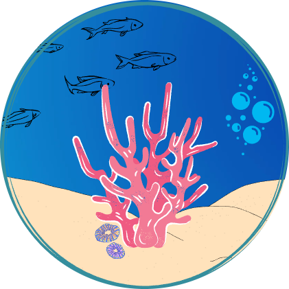

  <h3>
    <a href="">
      Documentazione
    </a>
  </h3>

# Indice

- [Introduzione](#Introduzione)
- [Installazione](#Installazione)
- [Contributors](#Contributors)
- [COTS](#Component)
    - [Tools](#tools)
    - [Libraries](#libraries)

# Introduzione

Piattaforma web per il reintegro della barriera corallina. 
- Fornisce la possibilità di sostenere economicamente un ente che si occupa della protezione ambientale con la possibilità di ricevere in cambio un voucher.
- Fornisce uno strumento di monitoraggio real-time dello stato di salute delle acque.

# Installazione

# Contributors

# Component Off-the-Shelf

### Tools

| Name                                                        | License                                                        |
| ----------------------------------------------------------- | -------------------------                                      |
| [MySql](https://www.mysql.com/it/)                          |            |
| [Maven](https://maven.apache.org/)                          |   |
| [Tomcat](http://tomcat.apache.org/)                         |   |
| [Bootstrap](https://getbootstrap.com/)                      | |

### Libraries

| Name                                                       | License                                                        |
| ---------------------------------------------------------- | ----------                                                     |
| [jQuery](https://jquery.com/)                              | |
| [JSTL](https://javaee.github.io/jstl-api/)                 |             |
| [Lombok](https://projectlombok.org/)                       | |
| [Mockito](https://site.mockito.org/)                       | |
